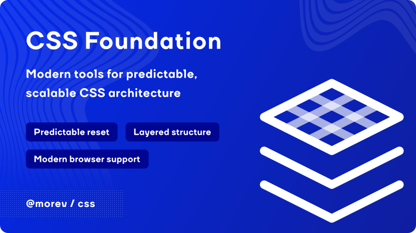

[](https://opensource.org/licenses/MIT)


# @morev/css

A modern CSS foundation for projects whose entire visual layer is controlled by a design system.

`@morev/css` removes browser presentation to provide a neutral canvas while
preserving semantics, appropriate display modes, and essential native behavior.

## Installation

```sh
pnpm add @morev/css
```

## Structure

The foundation is split into three stylesheets:

- [`core.css`](./src/reset/core.css) removes user-agent presentation and normalizes browser differences.
- [`base.css`](./src/reset/base.css) adds design-system-ready defaults for typography, layout, and interaction.
- [`reduced-motion.css`](./src/reset/reduced-motion.css) optionally applies a strict reduced-motion policy.

The required `core` and `base` stylesheets are also available together as `reset.css`. \
All selected stylesheets must come before the design-system styles.

## Cascade layers

The distributed stylesheets intentionally do not declare an `@layer`.
Element selectors are wrapped in `:where()` so they add no specificity;
this preserves the expected cascade in projects that do not use layers.

## Usage

```css
@layer reset, design-system;

@import '@morev/css/reset/core.css' layer(reset);
@import '@morev/css/reset/base.css' layer(reset);

/* Optional */
@import '@morev/css/reset/reduced-motion.css' layer(reset);

@import './design-system.css' layer(design-system);
```

Using cascade layers is optional. Import the selected stylesheets before the design-system styles directly:

```css
@import '@morev/css/reset.css';

/* Optional */
@import '@morev/css/reset/reduced-motion.css';

@import './design-system.css';
```

## Browser support

The package targets the moving [Baseline Widely Available](https://web.dev/baseline/) window
and keeps compatibility rules until the corresponding native behavior has been available
across the Baseline browser set for at least 30 months.

## Playground

The [`playground`](./playground/) compares native and reset rendering
side by side and documents the behavior of every stylesheet.
